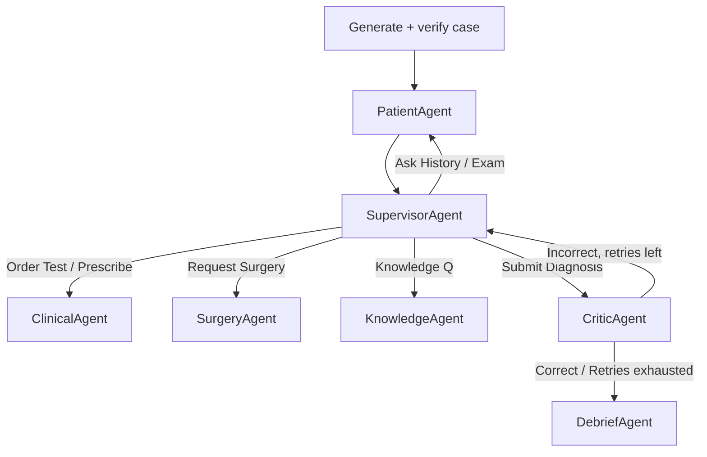

# 🩺 MedSim — Multi-Agent AI Clinical Case Simulator

A clinical-reasoning simulator for medical students. Pick one or more
specialties and difficulty; an AI **authors a brand-new patient case on the
spot**, then role-plays the patient in conversation while you work it up —
asking history, examining, ordering tests, prescribing drugs, requesting
surgery, and committing to a diagnosis. **Every decision is scored against
clinical-practice guidelines**, and every point links to the guideline that
justified it.

> ⚠️ **Educational use only.** Cases are AI-generated and *simplified* for
> teaching. It is **not** a clinical decision tool. Generated cases are labelled
> *AI-generated · unreviewed*.

There is **no case bank**. Every case is generated live through a
generate-then-verify pipeline, so an **LLM API key is required** to run the app.
(The test suite runs offline with no key.)

---

## ✨ Highlights

- **Pure AI generation.** No hard-coded cases — each patient is authored on
  demand, constrained to a real drug/lab vocabulary, then checked by independent
  reviewer agents before you see it.
- **Multi-agent over LangGraph.** A **Supervisor** routes each action to a
  specialised agent (Patient, Clinical, Surgery, Knowledge, Critic; a Debrief
  agent at case end) over a compiled **LangGraph** state machine — with an
  exactly-equivalent built-in router as a fallback (parity-tested).
- **Agents call real tools.** Five function-calling tools (`lab_simulator`,
  `drug_effect_engine`, `emergency_surgery`, `knowledge_lookup`,
  `symptom_generator`), each a pure Python function *and* a FastAPI endpoint.
- **Three grounded LLM roles.** It **authors cases**, **voices the patient**
  (grounded + diagnosis leak-guarded), and answers knowledge questions as **RAG**
  — deterministic layers always own the facts and the scoring.
- **Real-world data grounding.** The drug catalog is grounded in RxNorm/RxClass,
  openFDA labels, and DDInter 2.0 (see [Data sources](#-data-sources--attribution)).
- **Citations you can trust.** Generated guideline URLs are resolution-checked; a
  dead link is replaced with a real literature search and flagged *citation
  unverified* per case.
- **Deep, deterministic scoring.** Guideline-cited rubric + **severity weighting**,
  **executable safety gates**, and **metacognition** scoring (ranked differentials
  + confidence calibration + premature-closure).
- **End-of-case attending debrief** — a structured diff of your work-up vs. the
  ideal, with cited teaching points.
- **Agent-trajectory observability.** Every action is an OpenTelemetry-shaped
  span; the app shows a live routing graph + trajectory table, exportable as JSON.
- **146 passing tests** + a prior **adversarial multi-agent code review** (11 bugs
  found & fixed).

---

## 🚀 Quickstart

```bash
python -m venv venv && venv\Scripts\activate      # Windows
# source venv/bin/activate                         # macOS/Linux

pip install -r requirements.txt

# An LLM key is REQUIRED — cases are AI-generated. Copy .env.example → .env and set
# GOOGLE_API_KEY (Gemini) or ANTHROPIC_API_KEY (Claude), then install that SDK:
pip install google-genai            # or: pip install anthropic

python scripts/initialize_data.py                  # reference-data health check
streamlit run app.py                               # launch the UI  → http://localhost:8501
```

- **Run the tests** (offline, no key — injects fixture cases + mocks the LLM):
  `python -m pytest -q`
- **Run the tool API** (FastAPI): `python run_api.py` → Swagger UI at `/docs`
- **Docker** (UI + API + Redis): `docker compose up --build`

---

## 🎮 How a case works

1. **Start New Case** → the generator authors + verifies a case for your
   specialty/difficulty (~10 s), badged *AI-generated · unreviewed · verify N* and
   *citation verified / unverified*.
2. **Work it up** across four panels: History & Exam · Tests · Medications &
   Surgery · Knowledge & Diagnosis. The patient answers in natural language.
3. **Every action is scored live** against guidelines; the case log shows each
   point delta with an inline citation and an `LLM` badge when a reply was
   model-voiced.
4. **Commit a diagnosis** — optionally with ranked differentials and a confidence
   level. The **CriticAgent** grades it; the **DebriefAgent** produces an
   attending-style after-action report.

---

## 🏗️ Architecture

```
src/
├─ config.py         # specialties, scoring rubric, settings, PHYSICAL_EXAMS, feature flags
├─ state.py          # GameState / Message / ScoreEvent / TraceEvent / Debrief (Pydantic)
├─ store.py          # SessionStore (Redis → in-memory fallback)
├─ data_loader.py    # reference vocab (drugs/labs) + the runtime disease REGISTRY
├─ scoring.py        # apply_points() — the traceable rubric choke-point
├─ safety.py         # severity weighting + executable safety gates
├─ engine.py         # façade: create_generated_case / perform_action (+ trajectory)
├─ generator.py      # generate-then-verify case authoring + self-extending formulary
├─ grounding.py      # RxNorm / openFDA / DDInter transforms + citation resolution
├─ llm.py            # provider-pluggable client (Gemini / Claude / mock)
├─ trace.py          # OpenTelemetry-shaped agent-trajectory spans
├─ viz.py            # routing-graph SVG
├─ util.py           # stable seeding & text helpers
├─ tools/            # 5 pure-function tools + FastAPI gateway (server.py)
└─ agents/           # patient · clinical · surgery · knowledge · critic · supervisor
                     # · debrief · graph.py (LangGraph wiring)
data/                # drug_interactions.json (grounded), lab_refs.csv, generated/ (cache)
scripts/             # initialize_data.py · ground_drug_data.py
tests/               # unit / integrations (+ tests/fixtures/cases.json)
app.py               # Streamlit UI
```

Agents call the tool **functions** directly; the FastAPI server is a thin wrapper
over the same functions, so nothing requires a running server (which keeps the
tests infrastructure-free). **LangGraph is the live runtime**; set
`MEDSIM_USE_LANGGRAPH=0` to use the equivalent built-in router.

| Agent | Responsibility | Tools |
|---|---|---|
| **Supervisor** | routes actions, applies the rubric, enforces retries | — |
| **Patient** | intake, history & exam (grounded LLM dialogue) | `symptom_generator` |
| **Clinical** | labs & prescriptions (+ safety gates) | `lab_simulator`, `drug_effect_engine` |
| **Surgery** | surgical indication | `emergency_surgery` |
| **Knowledge** | RAG evidence answers | `knowledge_lookup` |
| **Critic** | grades the diagnosis (+ metacognition) | — |
| **Debrief** | end-of-case after-action report | — |



---

## 🤖 How every case is generated — and made safe

A generated case *is* the scoring answer key, so `src/generator.py` runs a
**generate-then-verify** harness for every case:

1. **Generate** — constrained to the controlled vocabulary; it can only reference
   real drugs/tests/exams. It also authors `severity` and `safety_gates`.
2. **Validate** — schema + integrity checks (drugs resolve, tests orderable,
   first-line ∩ contraindicated = ∅, gates reference known vocab, …). Mechanical
   issues auto-repair; anything else retries with the error fed back.
3. **Verify** — *N independent adversarial reviewers* (fresh context, temp 0)
   judge the medical claims against real FDA-label text; a majority + confidence
   threshold is required to accept.
4. **Citation check** — the guideline URL is resolution-tested; a dead link is
   replaced with a literature search and flagged `citation_verified: false`.
5. **Register** — tagged `ai-generated · reviewed_by_human: false`, cached to
   `data/generated/` (git-ignored), and badged in the UI.

**Self-extending formulary.** When a condition's first-line therapy needs a drug
the engine doesn't stock, the model **authors the drug too** (class, allergy
family, interactions), validated + reviewed, then merged into the live drug DB.
E.g. generating a gout case introduces *Colchicine* with its *major* statin
interaction — which then fires if a student co-prescribes them.

```python
from src import engine
state = engine.create_generated_case("Emergency", difficulty=2)  # authors + verifies + starts
```

Tune with `MEDSIM_GEN_VERIFIERS` / `MEDSIM_GEN_MIN_CONFIDENCE` /
`MEDSIM_GEN_MAX_ATTEMPTS`; provider via `MEDSIM_LLM_PROVIDER`.

---

## 🎯 Scoring

Defined in [`src/config.py`](src/config.py), applied through the single choke-point
`scoring.apply_points`. Every `ScoreEvent` records the **agent, action, delta,
reason, and guideline citation**.

| Category | Examples |
|---|---|
| **Work-up** | appropriate test +10 · unnecessary test −5 · informative history/exam +1 |
| **Drugs** | guideline first-line +15 · reasonable +3 · contraindicated/allergen −20 · avoided allergy +5 · major interaction −5 |
| **Surgery** | indicated +20 · unwarranted −25 |
| **Diagnosis** | correct +30 · true dx ranked as a differential +12/+8/+6 · plausible differential +10 · incorrect −15 |
| **Metacognition** | well-calibrated (right & confident) +5 · overconfident error −8 · prudent uncertainty +2 · premature closure −5 |
| **Safety gates** | violating an ordered dependency (per-gate penalty) |

- **Severity weighting** — each case has a severity (1 routine → 3
  life-threatening) that scales diagnosis stakes and unsafe actions (×1.0/1.5/2.0).
- **Executable safety gates** — ordered dependencies the engine enforces, e.g.
  *check potassium (BMP) before insulin*, *β-hCG before imaging in a child-bearing
  patient*. Doing the risky step first is penalised.
- **End-of-case debrief** — diffs your work-up against the ideal (tests/drugs
  hit vs. missed, low-value orders, key findings), with cited teaching points; an
  attending-style narrative is LLM-voiced when a key is set, deterministic otherwise.

---

## 📚 Data sources & attribution

The drug reference data is **grounded against real datasets** (run
`python scripts/ground_drug_data.py` to rebuild `data/drug_interactions.json`):

- **RxNorm / RxClass** (U.S. National Library of Medicine) — drug classes + ATC codes. Free, no licence.
- **openFDA drug-label API** (U.S. FDA) — monographs, contraindications, DailyMed citation URLs. Public domain (CC0 1.0).
- **DDInter 2.0** (SCBDD, Central South University) — pairwise interaction severities. **CC BY-NC 4.0 — non-commercial use only.**
- **ONC High-Priority DDI list / CredibleMeds** — expert-consensus high-severity overrides.

Provenance is recorded in `data/drug_interactions.json` (`_meta.sources`) and each
drug's `sources` list. Not affiliated with or endorsed by the FDA, NLM, or any
dataset provider.

---

## 🔭 Observability

Every action is recorded as an **OpenTelemetry-shaped span** (which agent ran,
which tools, Δpoints, latency, whether an LLM was used). The app renders a live
**routing graph** + trajectory table and exports the trajectory as JSON
(`src/trace.py`, `src/viz.py`).

---

## 🔌 Configuration (env vars)

| Variable | Effect |
|---|---|
| `GOOGLE_API_KEY` / `ANTHROPIC_API_KEY` | **Required** — enables case generation, LLM patient, RAG. Provider auto-selected. |
| `GEMINI_MODEL` / `ANTHROPIC_MODEL` / `MEDSIM_LLM_PROVIDER` | Model / provider overrides |
| `MEDSIM_GEN_VERIFIERS` / `MEDSIM_GEN_MIN_CONFIDENCE` / `MEDSIM_GEN_MAX_ATTEMPTS` | Generate-then-verify tuning |
| `MEDSIM_CHECK_CITATIONS` | Toggle the guideline-URL resolution check (default on) |
| `MEDSIM_USE_LANGGRAPH` | `0` to use the built-in router instead of LangGraph |
| `MEDSIM_DISABLE_PATIENT_LLM` / `MEDSIM_DISABLE_KNOWLEDGE_LLM` / `MEDSIM_DISABLE_DEBRIEF_LLM` | Force deterministic behaviour for that agent |
| `REDIS_URL` | Durable/cross-process session persistence (else in-memory) |
| `TAVILY_API_KEY` | Web fallback for `knowledge_lookup` |
| `QDRANT_URL` / `QDRANT_API_KEY` | Optional embedding upload (scaffolded) |

See [`.env.example`](.env.example).

---

## 📇 Tool API (FastAPI gateway)

The five tools are also exposed over HTTP (`src/tools/server.py`). Every response
includes a `citations` array.

| Endpoint | Body | Purpose |
|---|---|---|
| `POST /api/v1/symptoms` | `{disease_id}` | Sample present symptoms (frequency-weighted) |
| `POST /api/v1/labs` | `{ordered_tests, disease_id}` | Simulate labs/imaging with disease deviations |
| `POST /api/v1/drug` | `{drug, disease_id, patient_allergies, current_drugs}` | Allergy + interaction + guideline check |
| `POST /api/v1/lookup` | `{query}` | Guideline knowledge lookup (+ Tavily fallback) |
| `POST /api/v1/surgery` | `{procedure, disease_id}` | Validate surgical indication |

> Naming note: the plan referred to a "FastMCP gateway"; the implementation is a
> plain FastAPI service (not the Model Context Protocol).

---

## 🧪 What is (and isn't) built

**Implemented:** pure-AI case generation (generate-then-verify) with a
self-extending formulary; real-data drug grounding (RxNorm/openFDA/DDInter) +
citation verification; all six agents + Debrief over LangGraph (with a
parity-tested router fallback); five tools + FastAPI gateway; grounded LLM patient
& RAG knowledge; deterministic guideline-cited scoring with severity weighting,
safety gates, and metacognition; end-of-case debrief; trajectory observability;
the Streamlit UI; and a **146-test suite** with CI.

**Optional / stubbed** (need credentials or licensed data): Qdrant embedding
upload (wired in `initialize_data.py`, runs when configured), Tavily knowledge
fallback, LangSmith tracing, and Ragas evaluation. MIMIC-derived lab ranges and
ontology grounding (HPO/MONDO/UMLS) are researched but not yet wired.
